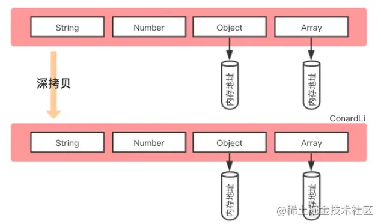
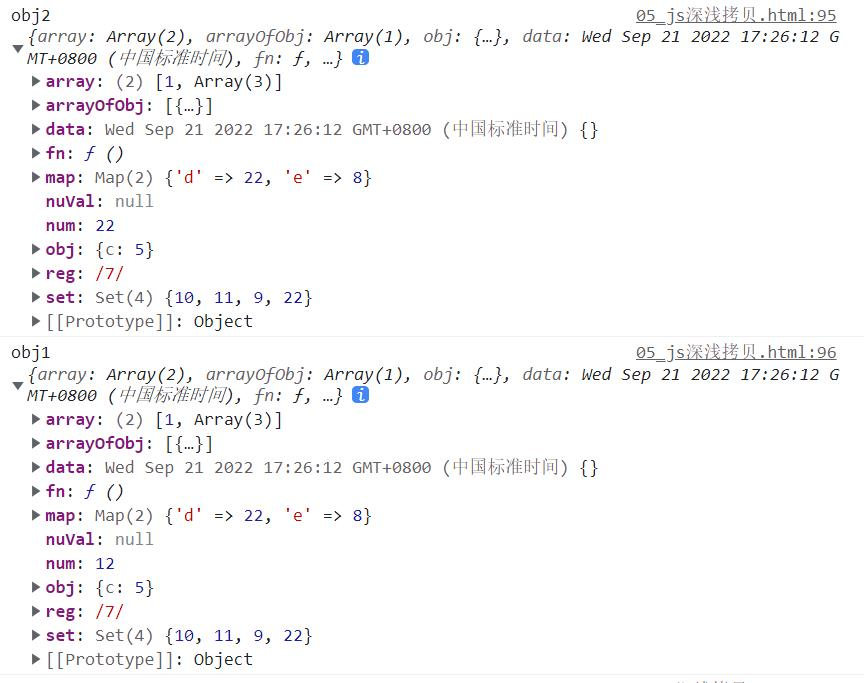
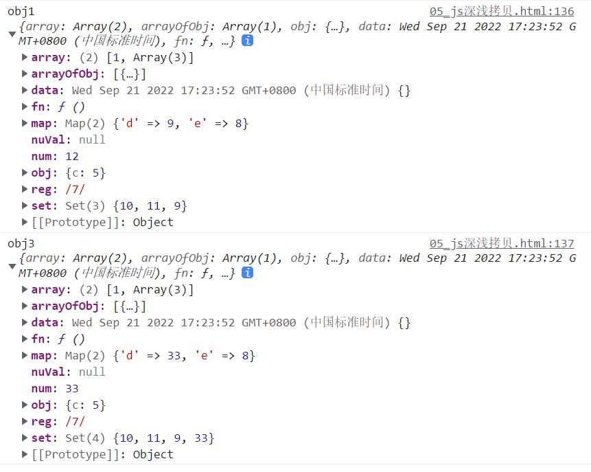
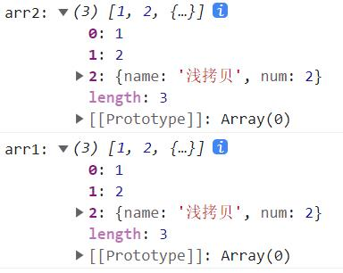

#深浅拷贝区分
---
##1 浅拷贝与深拷贝
---
### 1.1 浅拷贝
&emsp;&emsp;**浅拷贝**是创建一个新对象，这个对象有着原始对象属性值的一份精确拷贝。**如果属性是基本类型，拷贝的就是基本类型的值，如果属性是引用类型，拷贝的就是内存地址**，所以如果其中一个对象改变了这个地址，就会影响到另一个对象。

### 1.2 深拷贝
&emsp;&emsp;**深拷贝**是将一个对象从内存中完整的拷贝一份出来,从堆内存中开辟一个新的区域存放新对象,且**修改新对象不会影响原对象**。

&emsp;&emsp;总而言之，浅拷贝只复制指向某个对象的指针，而不复制对象本身，**新旧对象还是共享同一块内存**。但深拷贝会另外创造一个一模一样的对象，**新对象跟原对象不共享内存**，修改新对象不会改到原对象。

---
##2 赋值与深浅拷贝的区别
---
*三者的区别：**比较的是引用类型***
- 对象赋值：当我们把一个对象赋值给一个新的变量时，**赋的其实是该对象在栈中的地址，而不是堆中的数据**。也就是两个对象指向的同一个存储空间，无论哪个对象发生改变，其实都改变的是堆存储空间的内容，因此，两个对象是联动的。
- 浅拷贝：重新在堆中创建内存，拷贝前后对象的基本数据类型互不影响，但**拷贝前后对象的引用类型因共享同一块内存**，会相互影响。
- 深拷贝：从堆内存中开辟一个新的区域存放新对象，对对象中的子对象进行递归拷贝，**拷贝前后的两个对象互不影响**。
### 2.1 对象赋值        
    let obj1 = {
        array: [1,2],
        arrayOfObj: [{a:3, b:4}],
        obj: {c:5},
        fn: function(){console.log(6);
        },
        data: new Date(),
        map: new Map([["d",8],["e",8]]),
        set: new Set([10, 11]),
        num: 12,
        reg: /7/,
        nuVal: null //null是对象
    }

    let obj4 = obj1;
    obj4.map.set("a", 1)
    obj1.set.add(1)
    obj4.array[1] = [3,4,5]
    obj1.data = '2022/09/21 18:00:00'
    console.log("obj1",obj1); 
    console.log("obj4",obj4);
    //（引用类型）对象赋值，obj4和obj1在栈内存中的变量名和对应的指针，都指向同一个堆内存地址，所以一个改变，另一个的值也改变

### 2.2 浅拷贝
    let obj1 = {
        array: [1,2],
        arrayOfObj: [{a:3, b:4}],
        obj: {c:5},
        fn: function(){console.log(6);
        },
        data: new Date(),
        map: new Map([["d",8],["e",8]]),
        set: new Set([10, 11]),
        num: 12,
        reg: /7/,
        nuVal: null //null是对象
    }

    function shallowClone(obj) {
        let target = {}
        for(let i in obj){
            if(obj.hasOwnProperty(i)){
                target[i] = obj[i]
            }
        }
        return target
    }

    let obj2 = shallowClone(obj1)
    obj2.num = 22
    obj2.array[1] = [2,3,4] //新旧对象共享同一块内存
    obj1.map.set('d', 22)
    obj1.set.add(22)
    console.log("obj2",obj2);
    console.log("obj1",obj1); 

### 2.3 深拷贝
    function deepClone(obj) {
        if(obj === null) return obj
        if(obj instanceof Date) return new Date(obj)
        if(obj instanceof RegExp) return new RegExp(obj)
        if(obj instanceof Map){
            let tmp = new Map();
            for(let [k, v] of obj){
                tmp.set(deepClone(k), deepClone(v))
            }
            return tmp;
        }
        if(obj instanceof Set){
            let tmp = new Set();
            for(let v of obj){
                tmp.add(deepClone(v))
            }
            return tmp;
        }
        if(typeof obj !== "object") return obj
        let cloneObj = new obj.constructor
        for(let key in obj){
            if(obj.hasOwnProperty(key)){
                //递归拷贝
                cloneObj[key] = deepClone(obj[key])
            }
        }
        return cloneObj
    }

    let obj3 = deepClone(obj1)
    obj3.num = 33
    obj3.array[1] = [7,8,9]
    obj3.map.set('d', 33)
    obj3.set.add(33)
    //互不影响
    console.log('obj1',obj1);
    console.log('obj3',obj3);

---
##3 赋值与深浅拷贝的区别
---
|名称|和原始数据是否指向同一对象|第一层数据为基本数据类型|原始数据中包含子对象|
|:--:|:--:|:--:|:--:|
|赋值|是|改变会使原始数据一同改变|改变会使原始数据一同改变|
|浅拷贝|否|改变不会使原始数据一同改变|改变会使原始数据一同改变|
|深拷贝|否|改变不会使原始数据一同改变|改变不会使原始数据一同改变|
---
##4 浅拷贝的实现方式
---
- 1. Object.assign() （针对对象）
`Object.assign({}, obj1)`
- 2. 函数库lodash的_.clone方法
- 3. 展开运算符...
`let obj6 = {...obj1}`
- 4. Array.prototype.concat() (针对数组)
    
        `let arr1 = [1, 2, {name: '浅拷贝1', num: 1}]`
        `let arr2 = arr1.concat()`
        `arr2[2].name = '浅拷贝'`
        `arr1[2].num = 2`
        `console.log('arr2:',arr2)`
        `console.log('arr1:',arr1)`
   

- 5. Array.prototype.slice() (针对数组)
        `let arr1 = [1, 2, {name: '浅拷贝1', num: 1}]`
        `let arr2 = arr1.slice()`
        `arr2[2].name = '浅拷贝'`
        `arr1[2].num = 2`
        `console.log('arr2:',arr2)`
        `console.log('arr1:',arr1)`

---
##5 深拷贝的实现方式
---
- 1. JSON.parse(JSON.stringify())
这也是利用JSON.stringify将对象转成JSON字符串，再用JSON.parse把字符串解析成对象，一去一来，新的对象产生了，而且对象会开辟新的栈，实现深拷贝。
**这种方法虽然可以实现数组或对象深拷贝,但不能处理函数、正则、Map、Set**，因为这两者基于JSON.stringify和JSON.parse处理后，得到的正则就不再是正则（变为空对象），得到的函数就不再是函数（变为null）了。
- 2. 函数库lodash的_.cloneDeep方法
- 3. jquery 中 $.extend()
  
     `$.extend(deepCopy, target, object1, [objectN])//第一个参数为true,就是深拷贝`

- 4. 手写递归函数
如上文deepClone方法

*来源：*
1 掘金：[浅拷贝与深拷贝](https://juejin.cn/post/6844904197595332622)

